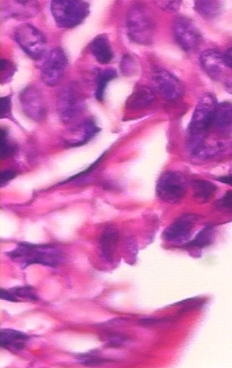
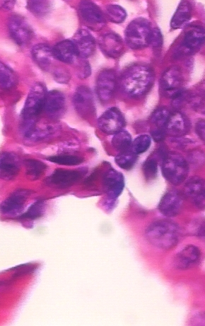
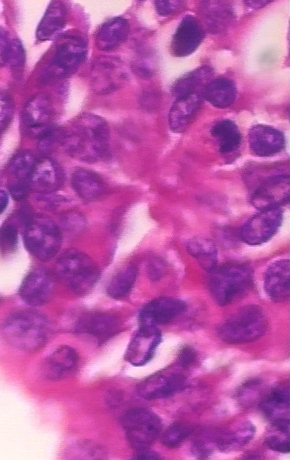
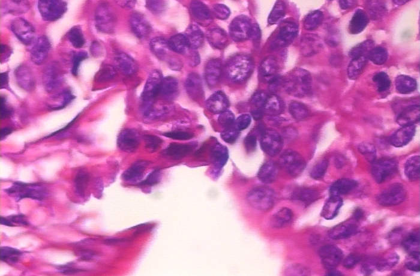

# Análise de métodos para costura de fragmentos de imagens de microscópios (Image Stitching)

Projeto desenvolvido em fevereiro de 2019, na disciplina de Visão Computacional, FGA.

Autores:
* Lucas Costa @lucasca73
* Lucas Carvalho
* Lucas Gomes
* Ricardo Canela
* Wesley Araujo @wparaujo

## Instalação
Os comandos de instalação e execução estão no makefile (pode ser ruim para windows executar makefile, Docker pode ser um desafio também ao ser executado no windows caso n seja versão enterprise ou pro).

```sh

make ## executa build e run da imagem

make run ## executa apenas o container, recomandado utilizar a build apenas uma vez já que baixar todo o conteúdo do opencv demore um pouco

make install ## executa instalação das dependências encontradas no arquivo requirements.txt utilizando pip install
```

# exemplos de imagens







